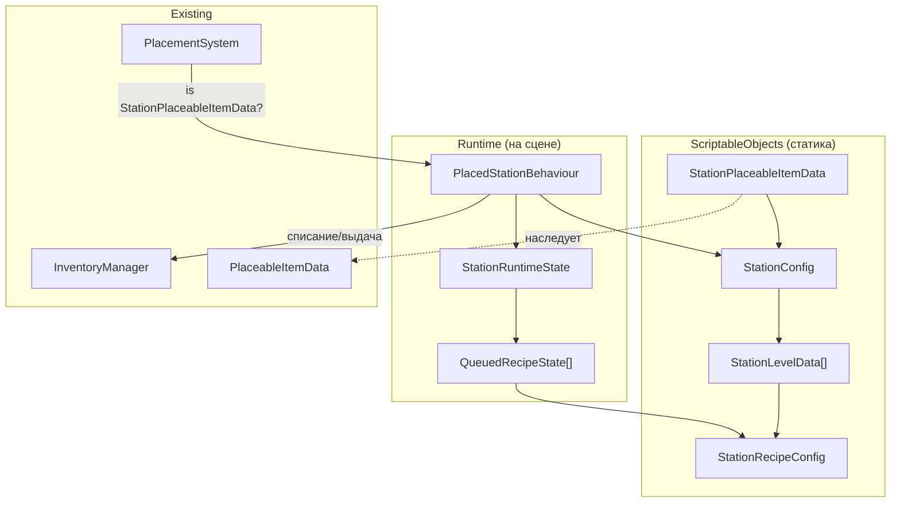

# Реализация системы станков (Мельница, Печь)

Система производства предметов на станках, построенная по тем же принципам, что и система растений: **Config (SO)** для статики → **RuntimeState** для сохранения → **Behaviour (MB)** для логики на сцене.

## Текущее состояние проекта

Что уже готово и на что мы опираемся:

| Компонент | Файл |
|---|---|
| `Item` (абстрактный базовый) | [Item.cs](file:///c:/Users/adminybiucha3d/Desktop/unityfarm/Farmfield/Assets/Scripts/Core/Common/Item.cs) |
| `SellableItem` (цена) | [SellableItem.cs](file:///c:/Users/adminybiucha3d/Desktop/unityfarm/Farmfield/Assets/Scripts/Core/Common/SellableItem.cs) |
| `ProduceItem` (урожай/продукт) | [ProduceItem.cs](file:///c:/Users/adminybiucha3d/Desktop/unityfarm/Farmfield/Assets/Scripts/Farming/Plants/ProduceItem.cs) |
| `PlaceableItemData` (базовая) | [PlaceableItemData.cs](file:///c:/Users/adminybiucha3d/Desktop/unityfarm/Farmfield/Assets/Scripts/Placement/Data/PlaceableItemData.cs) |
| `PlacementSystem` (размещение) | [PlacementSystem.cs](file:///c:/Users/adminybiucha3d/Desktop/unityfarm/Farmfield/Assets/Scripts/Placement/Systems/PlacementSystem.cs) |
| `InventoryManager` (синглтон) | [InventoryManager.cs](file:///c:/Users/adminybiucha3d/Desktop/unityfarm/Farmfield/Assets/Scripts/Inventory/UI/InventoryManager.cs) |
| Папка `Farming/Machines/` | Создана, но **пустая** |

## Архитектура



**Цикл работы станка:**
1. Игрок ставит станок на сетку (через `PlacementSystem`, как грядку).
2. Игрок подходит и нажимает на станок → открывается UI.
3. Игрок выбирает рецепт → проверяются ресурсы → списываются из инвентаря → заказ встает в очередь.
4. Очередь тикает — первый незавершённый элемент отсчитывает время.
5. Когда готово → игрок забирает результат в инвентарь.

---

## Proposed Changes

### Данные станков (Scriptable Objects)

Все новые SO-классы кладём в `Assets/Scripts/Farming/Data/`.

---

#### [NEW] `StationRecipeConfig.cs`
**Путь:** `Assets/Scripts/Farming/Data/StationRecipeConfig.cs`

Один рецепт — один ScriptableObject. Это позволит гибко переиспользовать рецепты между станками и уровнями.

```csharp
[CreateAssetMenu(menuName = "Farming/Station Recipe")]
public class StationRecipeConfig : ScriptableObject
{
    [Serializable]
    public struct Ingredient
    {
        public Item Item;
        public int Amount;
    }

    [Header("Рецепт")]
    public string RecipeName;          // "Мука", "Хлеб"
    public Ingredient[] Ingredients;   // [{Пшеница, 2}]
    
    [Header("Результат")]
    public Item ResultItem;            // SO Муки
    public int ResultAmount = 1;       // 1
    
    [Header("Время")]
    public float ProductionTimeSeconds; // 30 сек для муки
}
```

---

#### [NEW] `StationConfig.cs`
**Путь:** `Assets/Scripts/Farming/Data/StationConfig.cs`

Главный конфиг станка. Содержит массив уровней, каждый из которых открывает свои рецепты и даёт свои бонусы.

```csharp
[CreateAssetMenu(menuName = "Farming/Station Config")]
public class StationConfig : ScriptableObject
{
    [Serializable]
    public class LevelData
    {
        [Header("Уровень")]
        public int UpgradeCost;          // Цена улучшения ДО этого уровня (для 1-го = 0 или цена постройки)
        public int QueueSlots = 1;       // 1, 2, 3
        
        [Header("Скорость")]
        [Range(0.1f, 1f)]
        public float TimeMultiplier = 1f; // 1.0 = норма, 0.8 = на 20% быстрее
        
        [Header("Рецепты этого уровня")]
        public StationRecipeConfig[] Recipes; // Рецепты, ОТКРЫВАЕМЫЕ на этом уровне
    }

    public string StationName;           // "Мельница", "Печь"
    public LevelData[] Levels;           // [Level1, Level2, Level3]
}
```

**Пример настройки Мельницы:**
- `Levels[0]`: UpgradeCost=0, QueueSlots=1, TimeMultiplier=1.0, Recipes=[Мука]
- `Levels[1]`: UpgradeCost=150, QueueSlots=2, TimeMultiplier=1.0, Recipes=[Сахар]
- `Levels[2]`: UpgradeCost=300, QueueSlots=3, TimeMultiplier=0.8, Recipes=[] (новых рецептов нет, только ускорение)

---

#### [NEW] `StationPlaceableItemData.cs`
**Путь:** `Assets/Scripts/Placement/Data/StationPlaceableItemData.cs`

Аналог `PlantPlaceableItemData`. Наследует `PlaceableItemData`, добавляет ссылку на конфиг станка.

```csharp
[CreateAssetMenu(menuName = "Placement/Station Placeable Data")]
public class StationPlaceableItemData : PlaceableItemData
{
    [field: SerializeField, Header("Station")]
    public StationConfig Config { get; private set; }
}
```

---

### Рантайм состояние (Save / Load)

#### [NEW] `StationRuntimeState.cs`
**Путь:** `Assets/Scripts/Farming/Data/StationRuntimeState.cs`

Сериализуемые данные для сохранения. НЕ MonoBehaviour — чистые данные.

```csharp
[Serializable]
public class QueuedRecipeState
{
    public StationRecipeConfig Recipe;  // Какой рецепт
    public float RemainingTime;         // Сколько осталось (в секундах)
    public bool IsReady;                // Готов ли к сбору
}

[Serializable]
public class StationRuntimeState
{
    public int CurrentLevelIndex = 0;  // Индекс текущего уровня (0 = первый)
    public List<QueuedRecipeState> Queue = new List<QueuedRecipeState>();
}
```

---

### Логика на сцене (MonoBehaviour)

#### [NEW] `PlacedStationBehaviour.cs`
**Путь:** `Assets/Scripts/Farming/Machines/PlacedStationBehaviour.cs`

Вешается на префаб станка. Управляет очередью и производством.

| Метод | Что делает |
|---|---|
| `Init(StationPlaceableItemData, StationRuntimeState?)` | Инициализация конфигом. Если передан стейт — восстанавливает прогресс. |
| `Update()` | Тикает первый незавершённый элемент в очереди. Когда `RemainingTime <= 0`, ставит `IsReady = true`. |
| `GetAvailableRecipes()` | Возвращает все рецепты, доступные на текущем уровне (объединяет рецепты всех уровней от 0 до CurrentLevel). |
| `CanAffordRecipe(recipe)` | Проверяет, хватает ли ресурсов в инвентаре. |
| `TryAddToQueue(recipe)` | Проверяет слоты и ресурсы → списывает из инвентаря → добавляет в очередь с рассчитанным временем. |
| `CollectReady()` | Забирает первый готовый (`IsReady`) предмет → выдает `ResultItem` в инвентарь → удаляет из очереди. |
| `TryUpgrade()` | Проверяет наличие следующего уровня и денег → списывает → повышает `CurrentLevelIndex`. |

> [!IMPORTANT]
> **Зависимость от InventoryManager:** Сейчас в `InventoryManager` есть только `AddItem()` и НЕТ методов `RemoveItem()`, `HasItem()` или `GetItemCount()`. Для станков **необходимо** добавить в `InventoryManager`:
> - `bool HasItems(Item item, int count)` — проверить наличие N штук предмета
> - `bool RemoveItems(Item item, int count)` — списать N штук предмета
> 
> Без этого невозможно списывать ингредиенты при старте крафта.

---

### Модификации существующих файлов

#### [MODIFY] `InventoryManager.cs`
**Путь:** [InventoryManager.cs](file:///c:/Users/adminybiucha3d/Desktop/unityfarm/Farmfield/Assets/Scripts/Inventory/UI/InventoryManager.cs)

Добавляем два метода:

```csharp
// Проверить, есть ли в инвентаре нужное кол-во предметов
public bool HasItems(Item item, int count) { ... }

// Списать предметы из инвентаря. Возвращает true если успешно.
public bool RemoveItems(Item item, int count) { ... }
```

Логика: пройтись по `inventorySlots[]`, найти слоты с нужным `Item`, посчитать/удалить.

---

#### [MODIFY] `PlacementSystem.cs`
**Путь:** [PlacementSystem.cs](file:///c:/Users/adminybiucha3d/Desktop/unityfarm/Farmfield/Assets/Scripts/Placement/Systems/PlacementSystem.cs)

В методе `PlaceObject()` (строки 146-154), после существующей проверки `is PlantPlaceableItemData`, добавить аналогичную проверку для станков:

```csharp
// Строка ~154, после блока PlantPlaceableItemData:
else if (selectedPlaceableItem is StationPlaceableItemData stationData)
{
    PlacedStationBehaviour stationBehaviour = newObject.GetComponent<PlacedStationBehaviour>();
    if (stationBehaviour == null)
    {
        stationBehaviour = newObject.AddComponent<PlacedStationBehaviour>();
    }
    stationBehaviour.Init(stationData);
}
```

---

## Конкретные рецепты (будут создаваться как SO-ассеты в Unity Editor)

### Мельница

| Ур. | Рецепт | Ингредиенты | Время | Слоты | Множитель |
|---|---|---|---|---|---|
| 1 | Мука | 2× Пшеница | 30 сек | 1 | 1.0 |
| 2 | Сахар | 2× Тростник | 3 мин | 2 | 1.0 |
| 3 | *(нет нового)* | — | — | 3 | **0.8** |

### Печь / Кухня

| Ур. | Рецепт | Ингредиенты | Время | Слоты | Множитель |
|---|---|---|---|---|---|
| 1 (100💰) | Хлеб | 2× Мука + 1× Вода + 1× Яйцо | 3 мин | 1 | 1.0 |
| 1 | Запеченная картошка | 2× Очищ. картофель | 2 мин | 1 | 1.0 |
| 2 (350💰) | Суш. помидоры | 2× Помидор | 4 мин | 2 | 1.0 |
| 2 | Сладкий пирог | 2× Мука + 1× Сахар + 2× Яйцо | 4 мин | 2 | 1.0 |
| 3 (700💰) | ~~Пельмени~~ | ~~1× Мука + 1× Фарш~~ | — | 3 | 1.0 |

> [!NOTE]
> Пельмени пропускаем (нет животных). Уровень 3 Печи даёт только 3 слота очереди.

---

## Итого: какие файлы создаём/меняем

| Действие | Файл | Папка |
|---|---|---|
| **NEW** | `StationRecipeConfig.cs` | `Farming/Data/` |
| **NEW** | `StationConfig.cs` | `Farming/Data/` |
| **NEW** | `StationRuntimeState.cs` | `Farming/Data/` |
| **NEW** | `StationPlaceableItemData.cs` | `Placement/Data/` |
| **NEW** | `PlacedStationBehaviour.cs` | `Farming/Machines/` |
| **MODIFY** | `InventoryManager.cs` | `Inventory/UI/` |
| **MODIFY** | `PlacementSystem.cs` | `Placement/Systems/` |

---

## Open Questions

> [!WARNING]
> **Вопросы перед началом реализации:**
> 1. **Станки на сетке?** Станки размещаются на ту же сетку через `PlacementSystem` (как грядки), или они стоят на карте в фиксированных позициях и игрок их только открывает?
> 2. **Визуал при апгрейде?** Меняется ли внешний вид станка при переходе с уровня на уровень, или остаётся один и тот же префаб?
> 3. **`InventoryItem` и стакинг.** Сейчас `InventoryItem` не поддерживает стакинг (каждый предмет — отдельный слот). Поле `Stackable` и `MaxStack` есть в `Item`, но логика подсчёта не реализована. Для станков нужно будет хотя бы `HasItems` / `RemoveItems` — я реализую их на основе текущей 1-слот-1-предмет архитектуры. Это ок?

## Verification Plan

### Автоматическая проверка
- Проверка компиляции всех скриптов.

### Ручная проверка в Unity Editor
- Создать SO рецепта Муки (2 Пшеницы → 30 сек → 1 Мука).
- Создать SO конфига Мельницы с 3 уровнями.
- Создать SO `StationPlaceableItemData` для Мельницы.
- Создать префаб станка с `PlacedStationBehaviour`.
- Поставить станок на сетку → убедиться, что `Init` вызывается.
- Через `[ContextMenu]` протестировать `TryAddToQueue`, `CollectReady`, `TryUpgrade`.
